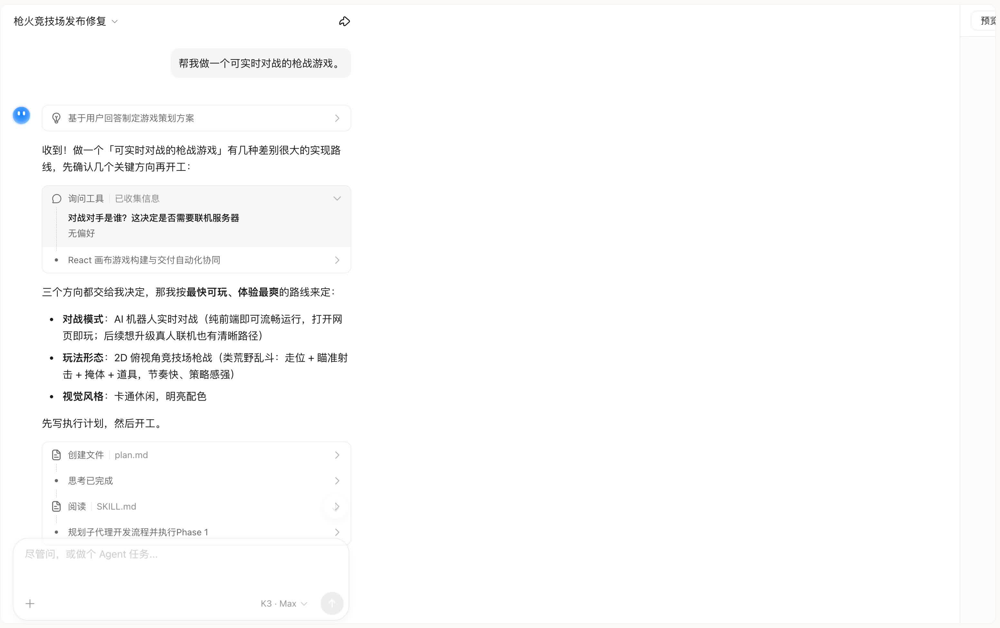
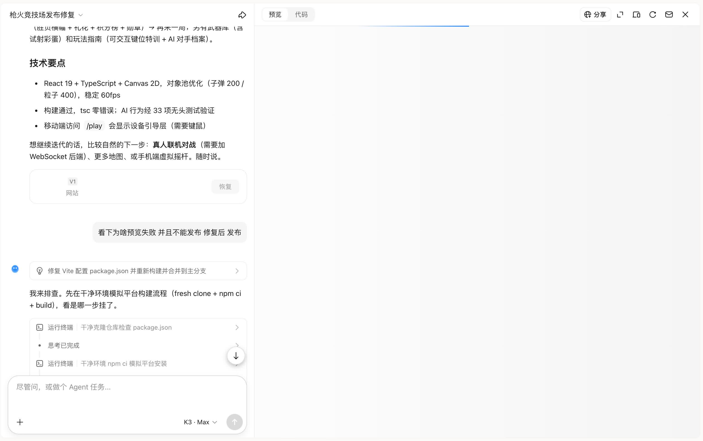
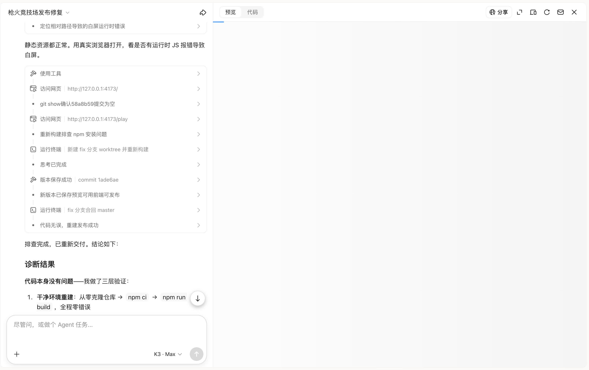

# 枪火竞技场 Gun Arena 🔫

> 一句话提示词 → Kimi K3 集群（4 个子代理协作）→ 完整可玩的浏览器射击游戏。全程零人工代码。

[🇺🇸 English](README.md) · [▶️ **在线试玩**](https://oqb4irirfijvw.ok.kimi.link) · [它是怎么被 K3 集群造出来的](#-它是怎么被-k3-集群造出来的全程实录)


**2D 俯视角竞技场枪战 · 玩家 vs 4 个 AI 机器人 · 浏览器打开即玩，无需登录**

## ▶️ 快速开始

**在线玩：** https://oqb4irirfijvw.ok.kimi.link （Kimi 托管）

**本地跑：**

```bash
npm install
npm run dev                  # 开发模式
# 或
npm run build && npm run preview   # 生产构建 + 本地预览
```

**操作：** `WASD` 移动 · 鼠标瞄准 · 左键射击 · `1-4` 切换武器 · `ESC` 暂停

## ✨ 游戏特性

- 🔫 **4 种武器**：手枪 / 霰弹枪 / 步枪 / 狙击枪（伤害、射速、弹匣、散射各不相同）
- 🤖 **4 个 AI 机器人同场竞技**：铁皮蛋 / 暴躁菇 / 跑跑姜 / 神枪阿亮 —— 状态机驱动的个性（巡逻 / 追击 / 撤退 / 抢道具）+ 难度梯度
- 🗺 **竞技场地图**：掩体障碍、灌木丛隐身点、道具刷新点（回血包 / 武器箱 / 护盾）
- ⏱ **3 分钟回合制**：击杀计分、实时积分榜、结算撒花
- 💥 **打击感**：粒子特效、屏幕震动、击杀播报；对象池优化（子弹 200 / 粒子 400）稳定 60fps
- 🔊 **WebAudio 合成音效**：零外部音频资源，全部代码实时合成
- 📱 **H5 适配**：响应式布局，移动端有键鼠引导层


## 🛠 技术栈

React 19 · TypeScript · Canvas 2D 游戏循环 · Tailwind CSS · Vite · WebAudio API

游戏引擎在 [`src/game/`](src/game/)：`engine.ts`（循环）、`ai.ts`（机器人状态机）、`world.ts`（地图与碰撞）、`audio.ts`（合成音效）、`render.ts`（渲染）。

## 🐝 它是怎么被 K3 集群造出来的（全程实录）

不是一次对话糊出来的 demo，而是一支 AI 小团队的真实协作 —— 有高光，也有翻车。整个过程中人类只输入了一句话：

> 「帮我做一个可实时对战的枪战游戏。」

### 1️⃣ 先想明白再动手

编排器没有上来就写代码，而是先摆清几条实现路线 —— 真人联机要 WebSocket 服务器，纯前端 AI 对战打开即玩 —— 然后按"最快可玩、体验最爽"拍板：**2D 俯视角竞技场 vs AI 机器人**（类荒野乱斗：走位+瞄准+掩体+道具）。接着产出 [`docs/process/plan.md`](docs/process/plan.md)，验收标准写得明明白白。



### 2️⃣ 招募 4 个子代理，分工并行

| 子代理 | 任务 | 状态 |
|--------|------|------|
| 巴泰 | 脚手架：落地页 + 共享组件库 + 音效引擎 + 游戏常量 | ✅ 已解雇 |
| 泰吉 | 对战核心 `/play`：引擎、战斗、AI、HUD | ✅ 已解雇 |
| 鲍蒙 | 结算页 `/results` | ✅ 已解雇 |
| 费曼 | 武器库 + 玩法指南页 | ✅ 已解雇 |

### 3️⃣ 💥 撞上真实工程问题 —— 自己解决

终端记录能看到集群自己处理真实世界的麻烦：`package-lock.json` 合并冲突（还原重试）、`git index.lock` 排查清理、三页面并行构建、最终合并。


### 4️⃣ 像正规军一样验证

`tsc` 零错误、**33 项无头 AI 行为测试**、对象池优化稳 60fps、移动端引导层。全是自己给自己加的验收项。

### 5️⃣ 💥 V1 交付了……预览却是死的

首个版本快照（`58a8b59`）被发现是**空提交** —— 平台快照环节的瞬时故障（同期沙箱的 worktree 元数据还被并发操作清掉过一次）。用户回头反馈："预览失败，不能发布，修复后发布"。



### 6️⃣ 🔧 三层自查 → V2 上线

集群没有瞎猜，而是分层自证：从零克隆 → `npm ci` → `npm run build` 零错误；静态资源全部 200；真实浏览器跑一局 `/play` 实测可玩。确认代码无误后，在 `fix-preview` 分支重建快照 → **V2 `1ade6ae`** —— 就是现在线上这版。



### 📊 成绩单

- ✅ 自主产品决策与规划 · 4 代理并行构建 · git 手术自救 · 正规军验证习惯 · 诚实的故障分析
- 💥 V1 快照为空（平台侧，V2 已修复）· "真人实时对战"降级为 AI 机器人（没有服务器预算）—— 取舍合理，但值得写明

## 📂 目录结构

```
src/
├── game/          # 游戏引擎（循环/AI/渲染/音效/输入）
├── pages/         # 5 个页面：首页 / 对战 / 结算 / 武器库 / 指南
└── components/    # HUD、结算、内容组件
docs/process/      # K3 集群的过程产物（plan.md 等）
```

## 🎁 想亲手试试 Kimi K3？

通过我的邀请链接注册 Kimi，双方 100% 拿奖，最高可得 1 年会员等值权益 👉 [点击助力](https://kimi-bot.com/activities/zh-cn/viral-referral/share?scenario=invite&from=share_poster&invitation_code=YZYK4)

<a href="https://kimi-bot.com/activities/zh-cn/viral-referral/share?scenario=invite&from=share_poster&invitation_code=YZYK4">
  
</a>

---

同一个集群的另一个作品：[kimi-k3-worldcup-2026](https://github.com/genglintong/kimi-k3-worldcup-2026) —— 2026 世界杯里程碑动效网站。

由 [Kimi K3](https://www.kimi.com) 集群模式构建。觉得 AI 做的游戏还行，欢迎 ⭐。
